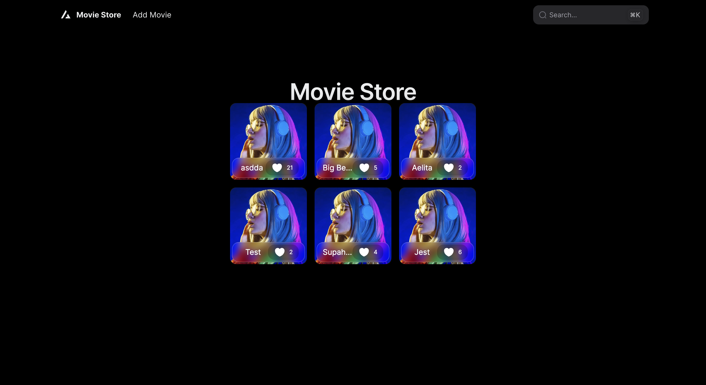
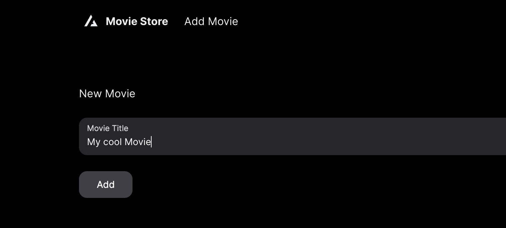

# movies-code-challenge
[classified]

# Setup and Installation

Make sure to have `docker` & `docker compose` in your machine.

Clone the repo, then run

`make start`

Then go to localhost:3000 on your browser of choice.

# Demo

